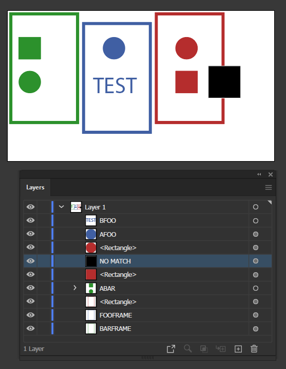
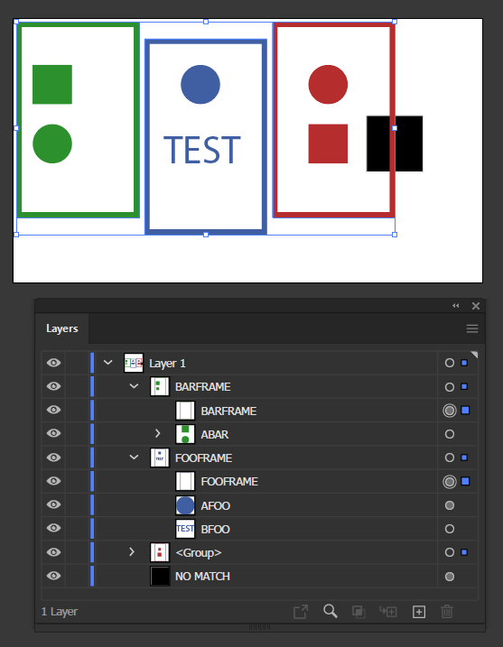

# frame inside

[Made by request on reddit here](https://www.reddit.com/r/AdobeIllustrator/comments/tsml9q/illustrator_geniuses_would_it_be_possible_to/)

Collects any pageItems contained within selected rectangles and groups them with their container, with groups inheriting container / frame / rectangle name.

## Before running script

We have several objects with outlined frames including group contents in no particular order:

## After selecting the frames and running script

Our frames are grouped with their content, placed at the top of the group, and the containing group inherits the frame's original name:

